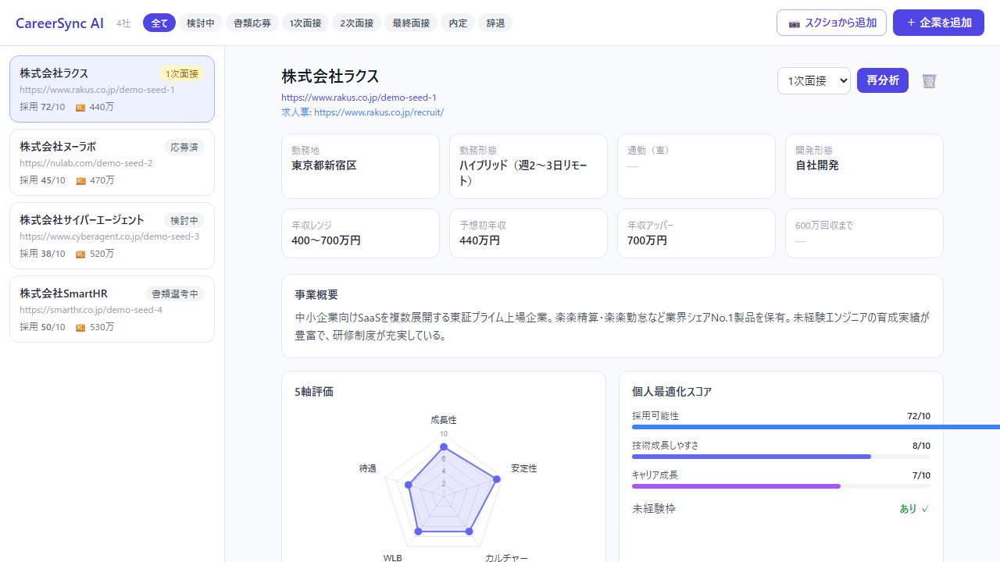
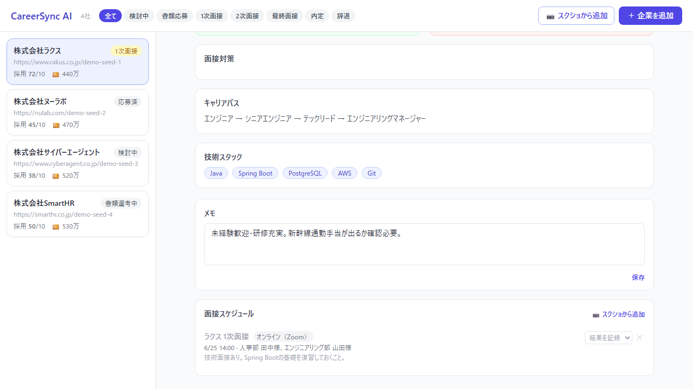
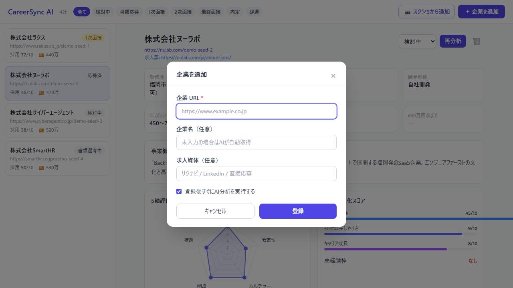
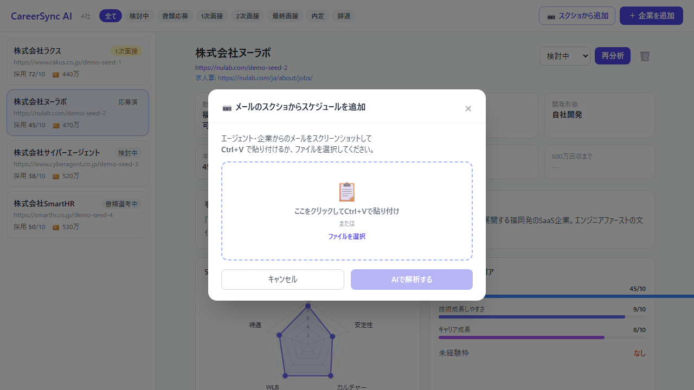
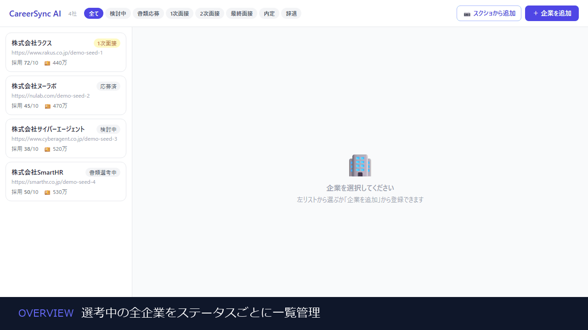

# CareerSync AI

> 転職活動用 パーソナル企業分析＆選考管理ハブ

[](https://python.org)
[](https://fastapi.tiangolo.com)
[](https://sqlite.org)
[](https://ai.google.dev)
[](https://tailwindcss.com)
[](LICENSE)

企業URLを1つ入力するだけで、Gemini AIが企業情報を自動収集・分析。スコアリング・比較・選考ステータス管理をすべて1つのダッシュボードで完結させる個人専用の「選考コマンドセンター」。

---

## このアプリでできること

- **URLを貼るだけでAI企業分析**: 事業概要・強み・弱み・面接対策が自動生成される
- **スコア比較**: 成長性・安定性・カルチャーフィット・WLB・待遇を5軸でレーダーチャート表示
- **横断比較ビュー**: 2〜4社をスプレッドシート風に並べて項目比較
- **選考ステータス管理**: 1クリックでステータス更新、進行状況が色で一目でわかる
- **面接対策クイックシート**: 想定問答をワンクリックコピー
- **メールスクショから自動登録**: 面接通知メールのスクショを貼るだけでスケジュールが自動登録される（フェーズ6）

---

## スクリーンショット

### ダッシュボード（選考状況の一覧）


### 企業詳細・5軸レーダーチャート



### 企業詳細（AI分析・面接対策クイックシート）



### 企業登録モーダル（URL入力→AI自動分析）



### メールスクショからの面接スケジュール自動登録



### 操作デモ（企業選択→詳細表示→モーダル操作）



---

## 技術スタック

| レイヤー | 技術 |
|---|---|
| バックエンド | Python 3.11+ / FastAPI |
| フロントエンド | HTML5 / Tailwind CSS (CDN) / Vanilla JS |
| データビジュアライゼーション | Chart.js |
| データベース | SQLite 3 |
| AI | Google Gemini 2.5 Flash |

---

## セットアップ手順

### 前提条件

- Python 3.11 以上がインストールされていること
- Gemini API キーを取得済みであること（[Google AI Studio](https://aistudio.google.com/) で無料取得可能）

### 1. リポジトリをクローン

```bash
git clone https://github.com/yusu31/CareerManagement.git
cd CareerManagement
```

### 2. Python仮想環境を作成・有効化

```bash
# 仮想環境の作成
python -m venv .venv

# 有効化（Windows PowerShell）
.\.venv\Scripts\Activate.ps1

# 有効化（Mac/Linux）
source .venv/bin/activate
```

### 3. 依存ライブラリをインストール

```bash
pip install -r requirements.txt
```

### 4. 環境変数を設定

プロジェクトルートに `.env` ファイルを作成:

```
GEMINI_API_KEY=ここにGemini APIキーを貼り付ける
```

### 5. サーバーを起動

```bash
uvicorn main:app --reload --port 8000
```

ブラウザで `http://localhost:8000` を開く。

---

## 開発フェーズ

| フェーズ | 内容 | 状態 |
|---|---|---|
| 0 | 環境構築 & プロジェクト基盤 | 完了 |
| 1 | データベース基盤（SQLite） | 完了 |
| 2 | バックエンドAPI基盤 | 完了 |
| 3 | AIインテグレーション | 完了 |
| 4 | UIプロトタイプ | 完了 |
| 5 | フロントエンドとAPI接続 | 完了 |
| 6 | メールスクショからスケジュール自動登録 | 完了 |
| 7 | 仕上げ・ドキュメント整備 | 完了 |

---

## AI の動作仕様

### できること

- 企業URLを1つ入力するだけで **30以上の項目を自動抽出**（企業名・従業員数・業種・勤務地・年収・技術スタックなど）
- 成長性・安定性・カルチャーフィット・WLB・待遇の **5軸スコアを自動算出**（1〜10点）
- 志望動機・自己PR・想定される面接質問と回答例を **自動生成**
- 面接通知メールのスクリーンショットを貼り付けるだけで **面接日時・形式・担当者を自動読取**
- ユーザーのプロフィール（居住地・現年収・希望職種）を反映した **個人最適化スコアリング**

### できないこと

- JavaScriptでのみ動作するサイト（SPAなど）は静的テキストの取得が困難な場合がある  
  → その場合はGeminiが公開情報をもとに一般的な分析を補完するため、**そのまま使い続けられる**
- リアルタイムでの求人情報更新・通知
- 複数ユーザーの同時利用（個人専用設計）
- モバイル最適化（PC ブラウザでの利用を推奨）

---

## トラブルシューティング

**Q: `"GEMINI_API_KEY が設定されていません"` というエラーが表示される**  
A: プロジェクトルートに `.env` ファイルを作成し、以下を記載してください。

```
GEMINI_API_KEY=AIzaここにAPIキーを貼り付ける
```

APIキーは [Google AI Studio](https://aistudio.google.com/) で無料取得できます。

---

**Q: `Error: [Errno 10048] Only one usage of each socket address` エラーが出る（ポート競合）**  
A: ポート 8000 が別のプロセスで使用されています。別のポートを指定してください。

```bash
uvicorn main:app --reload --port 8001
```

---

**Q: PowerShell で `.venv\Scripts\Activate.ps1` を実行すると「実行ポリシー」エラーが出る**  
A: 以下のコマンドを実行してから再試行してください。

```powershell
Set-ExecutionPolicy RemoteSigned -Scope CurrentUser
```

---

**Q: AI分析で「スクレイピングに失敗しました」と表示される**  
A: 正常な動作です。一部のサイトはスクレイピングをブロックしています。  
その場合、GeminiがURLのドメイン情報と一般知識をもとに分析を行うため、**分析自体は続行できます**。  
精度を上げたい場合は、企業の採用ページのURLを入力してみてください。

---

## ライセンス

個人プロジェクト / 学習目的
