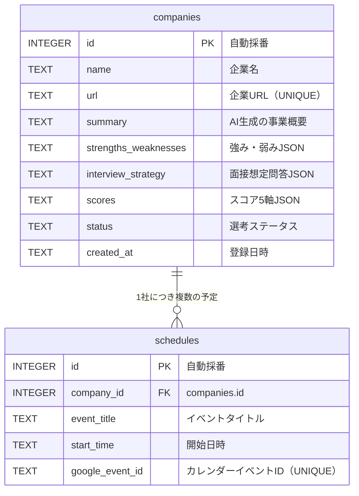

# データベース設計書

CareerSync AI — SQLite スキーマ定義

---

## ER図



---

## テーブル定義

### companies（企業情報）

| カラム名 | 型 | 制約 | 説明 |
|---|---|---|---|
| `id` | INTEGER | PK, AUTOINCREMENT | 自動採番ID |
| `name` | TEXT | — | 企業名（AI分析後に設定） |
| `url` | TEXT | NOT NULL, UNIQUE | 企業URL（重複登録防止） |
| `summary` | TEXT | — | AI生成の事業概要 |
| `strengths_weaknesses` | TEXT | — | 強み・弱みをJSON形式で保存 |
| `interview_strategy` | TEXT | — | 面接想定問答をJSON形式で保存 |
| `scores` | TEXT | — | スコア5軸をJSON形式で保存 |
| `status` | TEXT | NOT NULL, DEFAULT '検討中' | 選考ステータス |
| `created_at` | TEXT | NOT NULL, DEFAULT now | 登録日時 |

#### statusの取りうる値

```
検討中 → 書類応募 → 1次面接 → 2次面接 → 最終面接 → 内定 → 辞退
```

#### scores JSONの構造（例）

```json
{
  "growth": 8,
  "stability": 6,
  "culture_fit": 9,
  "work_life_balance": 7,
  "compensation": 5
}
```

各軸は1〜10の整数。AIが自動算出し、ユーザーが手動上書き可能。

#### strengths_weaknesses JSONの構造（例）

```json
{
  "strengths": ["SaaS市場でのシェア拡大中", "リモートワーク制度が充実"],
  "weaknesses": ["残業が多い部署あり", "給与水準がやや低め"]
}
```

#### interview_strategy JSONの構造（例）

```json
{
  "questions": [
    {"question": "弊社を選んだ理由は？", "answer_hint": "成長性と○○に共感..."},
    {"question": "5年後のキャリアビジョンは？", "answer_hint": "スペシャリストとして..."}
  ],
  "reverse_questions": [
    "入社後に最初に取り組む業務について教えてください",
    "チームの雰囲気を教えてください"
  ]
}
```

---

### schedules（面接スケジュール）

| カラム名 | 型 | 制約 | 説明 |
|---|---|---|---|
| `id` | INTEGER | PK, AUTOINCREMENT | 自動採番ID |
| `company_id` | INTEGER | NOT NULL, FK | companies.id を参照 |
| `event_title` | TEXT | NOT NULL | イベントタイトル（例: 「1次面接 @株式会社A」） |
| `start_time` | TEXT | NOT NULL | 開始日時（ISO 8601形式: `2026-06-20T14:00:00`） |
| `google_event_id` | TEXT | UNIQUE | Googleカレンダーイベントの一意ID（重複防止） |

- `company_id` は `ON DELETE CASCADE` — 企業を削除すると紐づくスケジュールも自動削除される
- `google_event_id` が NULL の場合は手動登録したスケジュールを意味する

---

## 設計上の判断メモ

### なぜJSONをTEXTで保存するか

SQLiteにはネイティブのJSON型がないが、`json_extract()` 関数でクエリ内でのフィールドアクセスが可能。
アプリ側（Python）でdict ↔ JSON文字列の変換を行う。
分析結果の構造が今後変わる可能性があるため、別テーブルに分割するより柔軟性が高い。

### なぜdatetime型ではなくTEXT型か

SQLiteにはネイティブのdatetime型がない。ISO 8601形式（`YYYY-MM-DDTHH:MM:SS`）のTEXTとして保存することで、
文字列ソートが日付ソートと一致する。

### 外部キー制約について

SQLiteはデフォルトで外部キー制約が無効。`connection.py` で `PRAGMA foreign_keys = ON` を設定することで有効化している。
